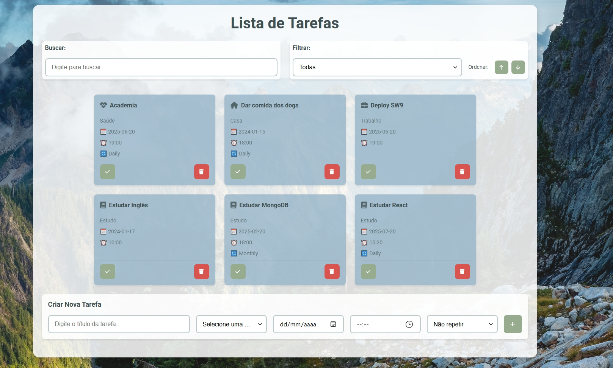

# Tasklist - Aplicativo de Gerenciamento de Tarefas

## 🎯 Sobre o Projeto

Este projeto foi desenvolvido como parte do meu aprendizado em React e desenvolvimento front-end moderno. O objetivo era criar uma aplicação completa de gerenciamento de tarefas que demonstrasse boas práticas de desenvolvimento, responsividade e experiência do usuário.

## 🚀 Funcionalidades Implementadas

### Core Features
- ✅ **CRUD Completo**: Criar, visualizar, atualizar e deletar tarefas
- ✅ **Sistema de Busca**: Busca instantânea com filtros em tempo real
- ✅ **Filtros Avançados**: Por status (ativa/concluída) e categoria
- ✅ **Ordenação**: Alfabética (A-Z / Z-A) com botões intuitivos
- ✅ **Layout Responsivo**: Adaptação perfeita para desktop, tablet e mobile

### UX/UI Features
- ✅ **Cards em Grid**: Layout moderno com cards organizados
- ✅ **Toast Notifications**: Feedback visual para ações do usuário
- ✅ **Animações Suaves**: Transições e hover effects
- ✅ **Estados Visuais**: Loading, erro, vazio e sucesso
- ✅ **Acessibilidade**: Navegação por teclado e leitores de tela

### Técnicas Avançadas
- ✅ **Persistência Local**: localStorage para manter dados entre sessões
- ✅ **Componentização**: Estrutura modular e reutilizável
- ✅ **CSS Moderno**: Flexbox, Grid, variáveis CSS e responsividade
- ✅ **Performance**: Otimizações de renderização e carregamento

## 🛠️ Tecnologias e Ferramentas

### Frontend
- **React 18**: Hooks, componentes funcionais e estado local
- **Vite**: Build tool moderno e rápido
- **CSS3**: Flexbox, Grid, variáveis CSS, animações
- **JavaScript ES6+**: Arrow functions, destructuring, spread operator

### Arquitetura e Padrões
- **Component-Based Architecture**: Separação clara de responsabilidades
- **Props e State Management**: Gerenciamento eficiente de dados
- **Event Handling**: Interações do usuário bem estruturadas
- **Responsive Design**: Mobile-first approach

## 📁 Estrutura do Projeto

```
src/
├── components/          # Componentes reutilizáveis
│   ├── Filter.jsx      # Sistema de filtros e ordenação
│   ├── Search.jsx      # Campo de busca com ícone
│   ├── Todo.jsx        # Card individual de tarefa
│   ├── TodoForm.jsx    # Formulário de criação/edição
│   └── Toast.jsx       # Sistema de notificações
├── App.jsx             # Componente principal
├── App.css             # Estilos globais e responsivos
└── main.jsx            # Ponto de entrada da aplicação
```

## 🎨 Decisões de Design e UX

### Layout e Responsividade
- **Grid System**: Cards organizados em grid responsivo
- **Breakpoints**: 1024px, 768px e 480px para diferentes dispositivos
- **Flexible Containers**: Adaptação automática ao conteúdo

### Interação do Usuário
- **Feedback Visual**: Toast notifications para todas as ações
- **Estados de Loading**: Indicadores visuais durante operações
- **Validação**: Mensagens de erro claras e específicas
- **Acessibilidade**: Foco visível e navegação por teclado

### Performance
- **LocalStorage**: Persistência eficiente sem necessidade de backend
- **CSS Otimizado**: Variáveis CSS para consistência e manutenibilidade
- **Componentes Leves**: Renderização eficiente e reutilização

## 🔧 Como Executar

1. **Clone o repositório:**
   ```bash
   git clone https://github.com/shivinhazen/tasklist.git
   cd Tasklist-main
   ```

2. **Instale as dependências:**
   ```bash
   npm install
   ```

3. **Inicie o servidor de desenvolvimento:**
   ```bash
   npm run dev
   ```

4. **Acesse a aplicação:**
   ```
   http://localhost:5173 (ou a porta informada no terminal)
   ```

## 📱 Responsividade

O projeto foi desenvolvido com abordagem mobile-first, garantindo experiência otimizada em:
- **Desktop**: Layout em grid com múltiplas colunas
- **Tablet**: Adaptação automática do grid
- **Mobile**: Layout em coluna única com navegação otimizada

## 🎯 Aprendizados e Desafios

### Desafios Técnicos Superados
1. **Gerenciamento de Estado**: Implementação eficiente de estado local com React hooks
2. **Responsividade**: Criação de layout que funciona perfeitamente em todos os dispositivos
3. **UX/UI**: Desenvolvimento de interface intuitiva e moderna
4. **Performance**: Otimização de renderização e carregamento
5. **Acessibilidade**: Implementação de padrões de acessibilidade web

### Habilidades Desenvolvidas
- ✅ React Hooks (useState, useEffect)
- ✅ Componentização e reutilização
- ✅ CSS moderno (Flexbox, Grid, variáveis)
- ✅ Responsive Design
- ✅ UX/UI Design
- ✅ JavaScript ES6+
- ✅ Versionamento com Git

## 📸 Screenshots



## 👨‍💻 Sobre o Desenvolvedor

Este projeto faz parte do meu portfólio pessoal, demonstrando minha evolução no desenvolvimento front-end com React. Foquei em criar uma aplicação completa que mostrasse não apenas conhecimento técnico, mas também preocupação com UX, performance e boas práticas de desenvolvimento.

### Contato
- [LinkedIn](https://www.linkedin.com/in/lucas-leao-shvzn)
- [GitHub](https://github.com/shivinhazen)
- [Email](mailto:lucasleaobcmt@gmail.com)

---

**Desenvolvido com dedicação e foco em qualidade** 💻✨
